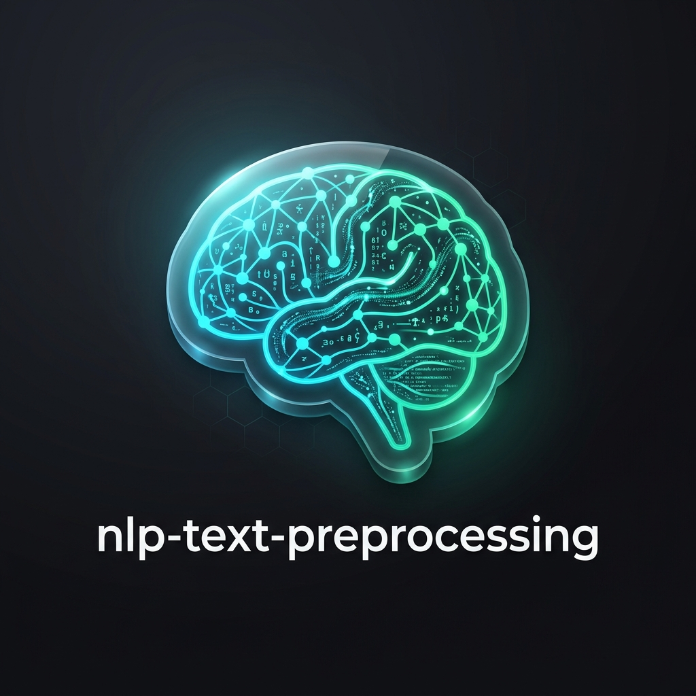

<div align="center">

  

  # 📚 nlp-text-preprocessing
  ### Official Web Documentation Suite & API Reference

  [](https://udityamerit.github.io/NLP-Text-Processing-Package-Documentation/)
  [](https://pypi.org/project/nlp-text-preprocessing/)
  [](https://udityanarayantiwari.netlify.app/)
  [](https://pepy.tech/projects/nlp-text-preprocessing)
  [](LICENSE)

  <p align="center">
    <b>A production-grade, null-safe Python NLP framework designed to streamline text cleaning, feature engineering, and linguistic analysis over Pandas DataFrames.</b>
  </p>

  [🌐 View Live Documentation Site](https://udityamerit.github.io/NLP-Text-Processing-Package-Documentation/) •
  [📦 View PyPI Package](https://pypi.org/project/nlp-text-preprocessing/) •
  [👨‍💻 Author Portfolio](https://udityanarayantiwari.netlify.app/)

</div>

---

## 📖 Overview

The **`nlp-text-preprocessing`** documentation suite provides an interactive, modern web experience for developers, data scientists, and ML engineers using the `nlp-text-preprocessing` Python package.

Designed according to enterprise web standards, this documentation site includes:
- **Interactive Code Popups**: Click on any API function name to launch a live code modal dialog with copyable Python code examples and expected outputs.
- **Null Safety Guarantees**: 100% crash-proof functions that accept `None` and `np.nan` values gracefully.
- **Zero-Overflow Mobile Responsive UI**: Fully responsive layout tailored for all viewports (mobile, tablet, desktop).
- **Dark & Light Mode**: Seamless theme switching with high-contrast accessibility.

---

## ⚡ Quick Start

### Installation

Install the package via `pip` or inside your virtual environment:

```bash
pip install nlp-text-preprocessing
```

### Basic Usage

```python
import nlp_text_preprocessing as tp

# 1. Text Cleaning & Normalization
text = "<b>Hello World!</b> Check out https://pypi.org/project/nlp-text-preprocessing/ now!"
cleaned = tp.clean_text(text)
print(cleaned)
# Output: hello world check out  now!

# 2. Statistical Feature Extraction
wc = tp.word_count("Natural Language Processing made easy")
print(f"Word Count: {wc}")
# Output: Word Count: 6

# 3. Contraction Expansion
expanded = tp.contraction_to_expansion("I'm sure it'll work!")
print(expanded)
# Output: I am sure it will work!
```

### Batch DataFrame Processing

```python
import pandas as pd
import nlp_text_preprocessing as tp

df = pd.DataFrame({
    'reviews': [
        "Great quality product and fast shipping!",
        "Terrible experience, will not recommend."
    ]
})

# Compute 5 statistical features in a single pass
features_df = tp.text_stats_batch(df, col='reviews')
print(features_df)
# Returns DataFrame columns: [word_count, char_count, avg_word_len, sentence_count, stop_words_count]
```

---

## 🛠️ API Reference Overview

The documentation site provides comprehensive reference tables across three core categories:

| Category | Capability | Functions Included |
| :--- | :--- | :--- |
| 📊 **General Feature Extraction** | Computes statistical metrics, word counts, and sentence lengths. | `word_count`, `char_count`, `avg_word_len`, `stop_words_count`, `sentence_count`, `avg_sentence_len`, `text_stats_batch` |
| 🧹 **Text Cleaning & Normalization** | Strips web artifacts, contractions, URLs, HTML tags, and accented characters. | `to_lower_case`, `contraction_to_expansion`, `remove_emails`, `remove_urls`, `remove_html_tag`, `remove_accented_chars`, `clean_text` |
| 🗣️ **Linguistic Processing** | Lemmatization, Part-of-Speech tagging, and Named Entity Recognition via spaCy. | `convert_to_base`, `extract_ner`, `extract_pos` |

---

## 🌐 Deploying to GitHub Pages

This repository is pre-configured with **GitHub Actions** for automatic deployment to GitHub Pages.

### Automated Workflow (`.github/workflows/static.yml`)
Every commit pushed to the `main` branch automatically builds and deploys the site live to GitHub Pages.

### One-Click Activation:
1. Navigate to **Settings** > **Pages** in your GitHub repository.
2. Under **Build and deployment**:
   - **Source**: Select `Deploy from a branch`
   - **Branch**: Select `main` / `/(root)`
3. Click **Save**.

Your site will be live at:
`https://udityamerit.github.io/NLP-Text-Processing-Package-Documentation/`

---

## 📂 Project Structure

```text
NLP-Text-Processing-Package-Documentation/
├── .github/
│   └── workflows/
│       └── static.yml           # GitHub Actions auto-deployment script
├── index.html                   # Introduction & Setup Landing Page
├── guide.html                   # Usage Guide & Pipeline Examples
├── api.html                     # Interactive API Reference with Code Modals
├── index.css                    # Unified CSS Design System & Theme Tokens
├── app.js                       # Theme Toggle, Highlight.js & Modal Popup Logic
├── nlp_logo.png                 # Package Branding Logo Asset
├── .nojekyll                    # Disables Jekyll processing for Pages
└── README.md                    # Repository Documentation
```

---

## 👨‍💻 Author & Contact

Crafted with care by **Uditya Narayan Tiwari**

- 🌐 **Portfolio**: [https://udityanarayantiwari.netlify.app/](https://udityanarayantiwari.netlify.app/)
- 📦 **PyPI Package**: [nlp-text-preprocessing](https://pypi.org/project/nlp-text-preprocessing/)
- 📊 **PePy Downloads**: [nlp-text-preprocessing Analytics](https://pepy.tech/projects/nlp-text-preprocessing)
- 🐙 **GitHub**: [@udityamerit](https://github.com/udityamerit)

---

<div align="center">
  <sub>Released under the MIT License • Built for the Python Open Source Community</sub>
</div>
